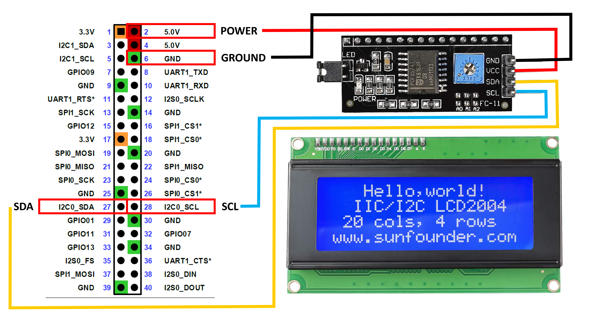

# Jetson Nano Bootstrap

Helpful guides on how to install the ROS2-ready system on the Jetson Orin Nano. The following instructions utilize an SSD to flash the Nano image. We recommend at least a 1 TB SSD installed into the NVMe SSD slot on the bottom of the Jetson. Before proceeding.

## Flashing Jetpack to the Device

Follow the [official instructions available from NVIDIA](https://www.jetson-ai-lab.com/initial_setup_jon.html). We recommend using the instructions in the section in *Alternative method : SDK Manager* section.

We suggest using JetPack 6.1.X. The host computer which performs the flashing of the Jetson will need to be an Ubuntu 20/22 device.

After flashing, boot the device, and proceed to setup a user name and password. We recommend naming the device `jetson`. For ease of use, we recommend setting the device to auto-login. Do not install the Chromium browser.

## Increasing Performance

Follow the [instructions](https://developer.nvidia.com/embedded/learn/get-started-jetson-orin-nano-devkit#maxn) from NVIDIA to switch the device to MAXN SUPER mode, which will operate the device with up to 25 W of power.

## Fixing Chromium

By default, the default source for the Chromium web browser is broken. Use the following commands to get a working version.

```bash
sudo apt update
sudo apt install flatpak
flatpak remote-add --if-not-exists flathub https://dl.flathub.org/repo/flathub.flatpakrepo
flatpak install flathub org.chromium.Chromium
```

## Installing ROS2

```bash
sudo apt update
sudo apt install -y curl gnupg2 lsb-release build-essential
sudo curl -sSL https://raw.githubusercontent.com/ros/rosdistro/master/ros.key -o /usr/share/keyrings/ros-archive-keyring.gpg
echo "deb [signed-by=/usr/share/keyrings/ros-archive-keyring.gpg] http://packages.ros.org/ros2/ubuntu $(lsb_release -cs) main" | \
  sudo tee /etc/apt/sources.list.d/ros2.list > /dev/null
sudo apt update
sudo apt install -y ros-humble-desktop
source /opt/ros/humble/setup.bash
echo "source /opt/ros/humble/setup.bash" >> ~/.bashrc
source ~/.bashrc
```

### Install Visual Studio Code
```bash
cd ~/Downloads
wget https://update.code.visualstudio.com/1.77.3/linux-deb-arm64/stable
sudo dpkg -i stable
```

## Installing Necessary System Packages

```bash
sudo apt install -y \
  python3-colcon-common-extensions \
  python3-rosdep \
  python3-vcstool \
  python3-pip \
  git \
  nano \
  htop \
  nvidia-cuda \
  nvidia-tensorrt \
  nvidia-opencv \
  terminator \
  libhidapi-dev
```

JTOP is the recommended system monitoring tool for processor/GPU performance. It must be installed with `sudo`.
`sudo pip3 install -U jetson-stats`

### Creating a Colcon Workspace

```bash
mkdir -p ~/ws/src
cd ~/ws
colcon build
```
We also add a utility command to assist with rebuilding the repo:
`
echo "alias build_ros='cd ~/ws && colcon build && source install/setup.bash'" >> ~/.bashrc
`

## Switch Desktop to XFCE

By default the desktop on the Jetson consumes around 1 GB of RAM during idle operation. We can improve that by switching to a lightweight desktop.

`sudo apt-get install xfce4`

After installing, log out, then when you log back in select the gear icon near the login button to change the desktop session to xfce. This change will persist the next time you log in.


## Configure Ports on the joystick controller and Arduino

Follow this dedicated [guide](./usb_rules.md) to setup the various required and optional device connections.

## Configure ROS Workspace
Move into the ROS workspace, clone necessary packages, and build repo.

```bash
cd ~/ws/src
git clone git@github.com:SPROUT-MITLL/sprout_ros.git # Install SPROUT ROS
git clone -b ros2 git@github.com:SPROUT-MITLL/ds5_ros.git # SPROUT fork of DS5 driver
cd ~/ws
colcon build
source ../devel/setup.bash
```
## Install Arduino IDE

These instructions will download an app image containing the Arduino IDE for an ARM64 device.
```bash
cd Downloads
wget https://github.com/koendv/arduino-ide-raspberrypi/releases/download/2.2.0/Linux_arm64_app_image.zip
unzip Linux_arm64_app_image.zip
chmod +x arduino-ide_2.2.1_Linux_arm64.AppImage # Make the app image executable
./arduino-ide_2.2.1_Linux_arm64.AppImage # Run the app image
```
Allow the application to initialize and install necessary packages upon first system boot. The [Encoder](https://docs.arduino.cc/libraries/encoder/) package is the only non-default package required to compile the sketch.

## Flash Arduino with Code

Connect the Arduino to the Jetson via USB cable.

Open the Arduino sketch: `~/ws/src/sprout_ros/arduino/vine_control/vine_control/vine_control_uno_rev3`

Make sure the IDE is connected to the Arduino Uno on `/dev/ttyACM0`. Verify and upload the sketch to the device.

Once `Upload Finished` is displayed, the device is ready to use!

## Adding the Screen

We need to enable the Jetson Nano to communicate with the LCD screen over GPIO. First run the following commands to enable software access.

```bash
sudo apt-get update
sudo pip3 install Jetson.GPIO
sudo groupadd -f -r gpio
sudo usermod -a -G gpio <<USER_NAME>>
```

Power off the Jetson, and unplug from the power source. Use the wiring guide below to connect the LCD screen to the Jetson using jumper wires.



## Start ROS Nodes Automatically

If you named your user something other than `jetson` during the setup, modify the home directory under the `ExecStart` command in `sprout_ros.service`.
```
sudo cp ~/ws/src/sprout_ros/resource/sprout_ros.service /etc/systemd/system/
sudo systemctl enable sprout_ros.service
```

In order to allow USB devices access on boot, we will need to give permission to unprivileged users.

```bash
cd /etc/udev/rules.d/
sudo touch local.rules
sudo nano local.rules
```
Add the following line into the file.

`echo "ACTION=="add", KERNEL=="dialout", MODE="0666"`

Reboot the system: `sudo reboot now`
